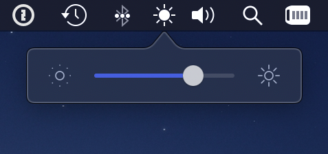

# Brightness-Menubar-App
A little macOS menu bar app to adjust screen brightness

I made this because my Touch Bar is dead.

Tip: Option-click to show menu.

[Download](https://github.com/RayPS/Brightness-Menubar-App/releases)
